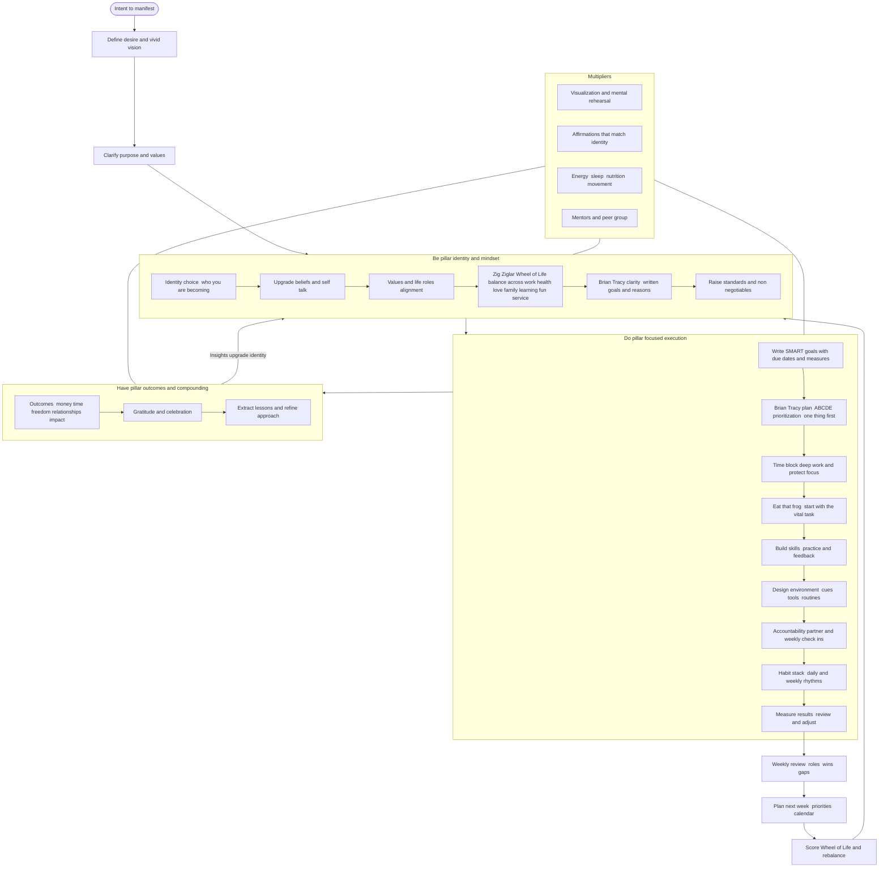

```mermaid
flowchart TB
  %% Core loop
  START([Intent to manifest])
  VISION[Define desire and vivid vision]
  PURPOSE[Clarify purpose and values]
  START --> VISION --> PURPOSE

  subgraph BE[Be pillar  identity and mindset]
    IDENTITY[Identity choice  who you are becoming]
    BELIEFS[Upgrade beliefs and self talk]
    VALUES[Values and life roles alignment]
    BALANCE[Zig Ziglar Wheel of Life balance across work health love family learning fun service]
    CLARITY[Brian Tracy clarity  written goals and reasons]
    STANDARDS[Raise standards and non negotiables]
    IDENTITY --> BELIEFS --> VALUES --> BALANCE --> CLARITY --> STANDARDS
  end

  subgraph DO[Do pillar  focused execution]
    GOALS[Write SMART goals with due dates and measures]
    PLAN[Brian Tracy plan  ABCDE prioritization  one thing first]
    TIME[Time block deep work and protect focus]
    ACTION[Eat that frog  start with the vital task]
    SKILLS[Build skills  practice and feedback]
    ENV[Design environment  cues  tools  routines]
    ACCOUNT[Accountability partner and weekly check ins]
    HABITS[Habit stack  daily and weekly rhythms]
    MEASURE[Measure results  review and adjust]
    GOALS --> PLAN --> TIME --> ACTION --> SKILLS --> ENV --> ACCOUNT --> HABITS --> MEASURE
  end

  subgraph HAVE[Have pillar  outcomes and compounding]
    RESULTS[Outcomes  money time freedom relationships impact]
    GRATITUDE[Gratitude and celebration]
    INSIGHT[Extract lessons and refine approach]
    RESULTS --> GRATITUDE --> INSIGHT
  end

  %% Flow between pillars
  PURPOSE --> BE
  BE --> DO
  DO --> HAVE

  %% Learning loop back to identity
  HAVE -->|Insights upgrade identity| BE

  %% Multipliers that power every pillar
  subgraph MULTIPLIERS[Multipliers]
    VIZ[Visualization and mental rehearsal]
    AFFIRM[Affirmations that match identity]
    HEALTH[Energy  sleep  nutrition  movement]
    MENTOR[Mentors and peer group]
  end

  MULTIPLIERS --- BE
  MULTIPLIERS --- DO
  MULTIPLIERS --- HAVE

  %% Weekly operating rhythm
  R1[Weekly review  roles  wins  gaps]
  R2[Plan next week  priorities  calendar]
  R3[Score Wheel of Life and rebalance]
  MEASURE --> R1 --> R2 --> R3 --> BE
```
