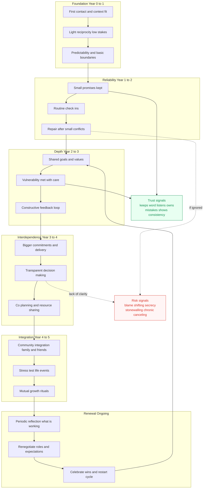

```mermaid
flowchart TD
  %% STAGE 1
  subgraph Foundation Year 0 to 1
    A1[First contact and context fit]
    A2[Light reciprocity low stakes]
    A3[Predictability and basic boundaries]
    A1 --> A2 --> A3
  end

  %% STAGE 2
  subgraph Reliability Year 1 to 2
    B1[Small promises kept]
    B2[Routine check ins]
    B3[Repair after small conflicts]
    A3 --> B1 --> B2 --> B3
  end

  %% STAGE 3
  subgraph Depth Year 2 to 3
    C1[Shared goals and values]
    C2[Vulnerability met with care]
    C3[Constructive feedback loop]
    B3 --> C1 --> C2 --> C3
  end

  %% STAGE 4
  subgraph Interdependence Year 3 to 4
    D1[Bigger commitments and delivery]
    D2[Transparent decision making]
    D3[Co planning and resource sharing]
    C3 --> D1 --> D2 --> D3
  end

  %% STAGE 5
  subgraph Integration Year 4 to 5
    E1[Community integration family and friends]
    E2[Stress test life events]
    E3[Mutual growth rituals]
    D3 --> E1 --> E2 --> E3
  end

  %% RENEWAL
  subgraph Renewal Ongoing
    F1[Periodic reflection what is working]
    F2[Renegotiate roles and expectations]
    F3[Celebrate wins and restart cycle]
    E3 --> F1 --> F2 --> F3 --> C1
  end

  %% QUICK REFERENCE SIGNALS
  classDef good fill:#e8fff1,stroke:#0b8f4d,color:#0b8f4d;
  classDef risk fill:#fff5f5,stroke:#d93025,color:#d93025;

  G[Trust signals<br> keeps word listens owns mistakes shows consistency]:::good
  R[Risk signals<br> blame shifting secrecy stonewalling chronic canceling]:::risk

  B1 --> G
  C2 --> G
  B3 -. if ignored .-> R
  D2 -. lack of clarity .-> R
```
