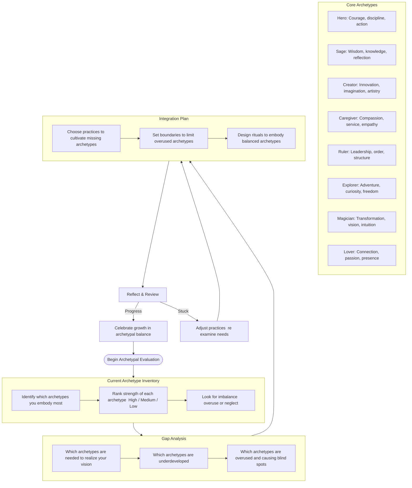

```mermaid
flowchart TB
  START([Begin Archetypal Evaluation])

  subgraph ARCHETYPES[Core Archetypes]
    HERO[Hero: Courage, discipline, action]
    SAGE[Sage: Wisdom, knowledge, reflection]
    CREATOR[Creator: Innovation, imagination, artistry]
    CAREGIVER[Caregiver: Compassion, service, empathy]
    RULER[Ruler: Leadership, order, structure]
    EXPLORER[Explorer: Adventure, curiosity, freedom]
    MAGICIAN[Magician: Transformation, vision, intuition]
    LOVER[Lover: Connection, passion, presence]
  end

  START --> INVENTORY

  subgraph INVENTORY[Current Archetype Inventory]
    IDSELF[Identify which archetypes you embody most]
    RANK[Rank strength of each archetype  High / Medium / Low]
    BALANCE[Look for imbalance  overuse or neglect]
    IDSELF --> RANK --> BALANCE
  end

  INVENTORY --> GAP

  subgraph GAP[Gap Analysis]
    DESIRE[Which archetypes are needed to realize your vision]
    DEFICIT[Which archetypes are underdeveloped]
    EXCESS[Which archetypes are overused and causing blind spots]
    DESIRE --> DEFICIT --> EXCESS
  end

  GAP --> ACTION

  subgraph ACTION[Integration Plan]
    CULTIVATE[Choose practices to cultivate missing archetypes]
    LIMIT[Set boundaries to limit overused archetypes]
    EMBODY[Design rituals to embody balanced archetypes]
    CULTIVATE --> LIMIT --> EMBODY
  end

  ACTION --> REVIEW[Reflect & Review]
  REVIEW -->|Progress| CELEBRATE[Celebrate growth in archetypal balance]
  REVIEW -->|Stuck| ADJUST[Adjust practices  re examine needs]
  CELEBRATE --> START
  ADJUST --> ACTION
```
