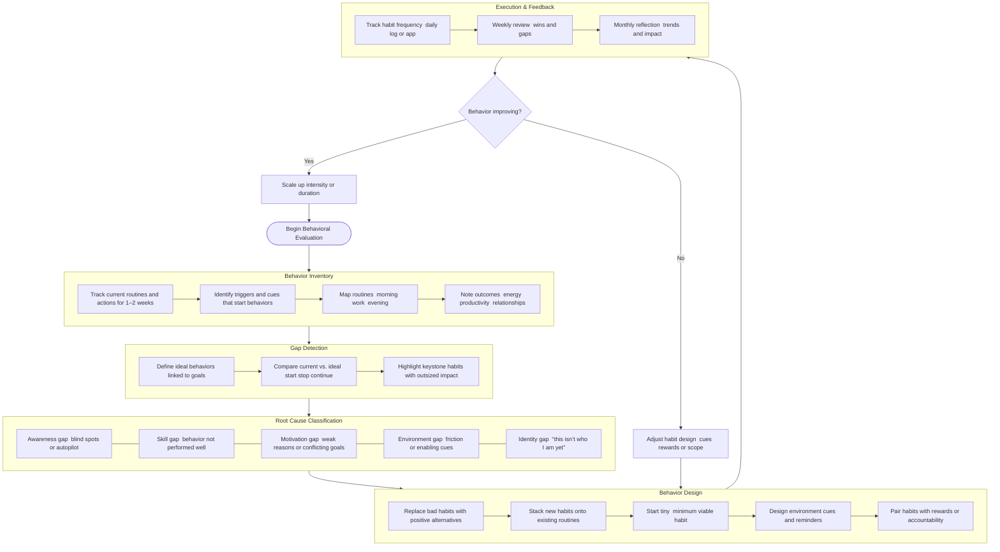

```mermaid
flowchart TB
  START([Begin Behavioral Evaluation])

  subgraph INVENTORY[Behavior Inventory]
    TRACK[Track current routines and actions for 1–2 weeks]
    CUES[Identify triggers and cues that start behaviors]
    PATTERNS[Map routines  morning  work  evening]
    OUTCOMES[Note outcomes  energy  productivity  relationships]
    TRACK --> CUES --> PATTERNS --> OUTCOMES
  end

  START --> INVENTORY --> GAP

  subgraph GAP[Gap Detection]
    IDEAL[Define ideal behaviors linked to goals]
    DELTA[Compare current vs. ideal  start stop continue]
    KEY[Highlight keystone habits with outsized impact]
    IDEAL --> DELTA --> KEY
  end

  GAP --> ROOT

  subgraph ROOT[Root Cause Classification]
    AWARE[Awareness gap  blind spots or autopilot]
    SKILL[Skill gap  behavior not performed well]
    MOTIVE[Motivation gap  weak reasons or conflicting goals]
    ENV[Environment gap  friction or enabling cues]
    IDENTITY[Identity gap  “this isn’t who I am yet”]
    AWARE --- SKILL --- MOTIVE --- ENV --- IDENTITY
  end

  ROOT --> PLAN

  subgraph PLAN[Behavior Design]
    REPLACE[Replace bad habits with positive alternatives]
    STACK[Stack new habits onto existing routines]
    TINY[Start tiny  minimum viable habit]
    TRIGGERS[Design environment cues and reminders]
    REWARD[Pair habits with rewards or accountability]
    REPLACE --> STACK --> TINY --> TRIGGERS --> REWARD
  end

  PLAN --> EXEC

  subgraph EXEC[Execution & Feedback]
    TRACKH[Track habit frequency  daily log or app]
    REVIEWW[Weekly review  wins and gaps]
    REVIEWM[Monthly reflection  trends and impact]
    TRACKH --> REVIEWW --> REVIEWM
  end

  EXEC --> LOOP{Behavior improving?}
  LOOP -->|Yes| SCALE[Scale up intensity or duration]
  LOOP -->|No| ADJUST[Adjust habit design  cues  rewards or scope]

  SCALE --> START
  ADJUST --> PLAN
```
