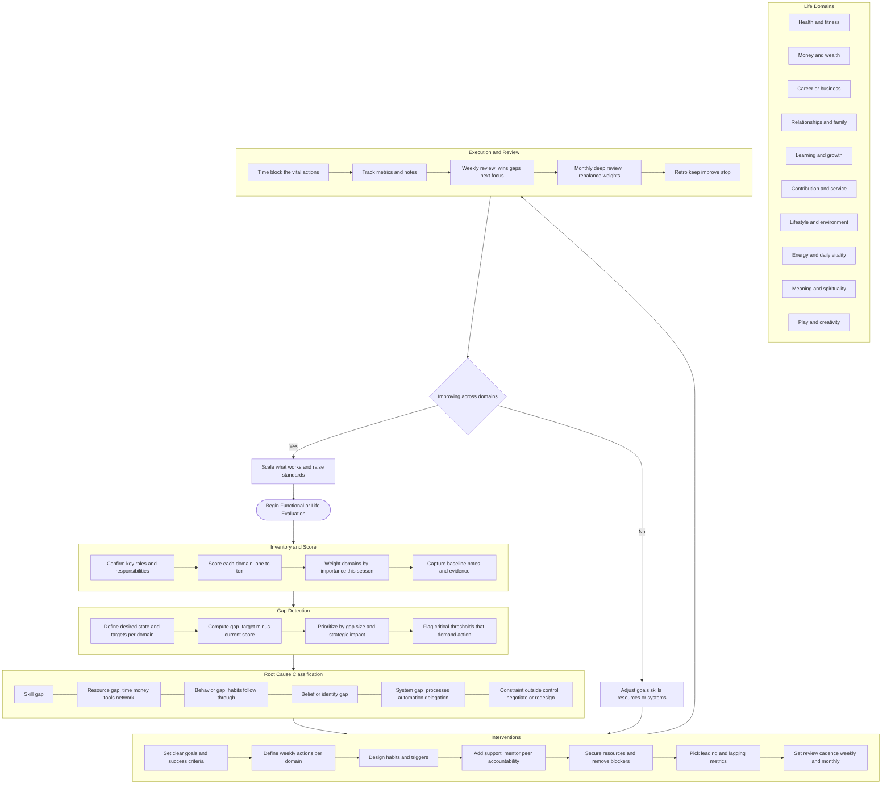

```mermaid
flowchart TB
  START([Begin Functional or Life Evaluation])

  subgraph AREAS[Life Domains]
    HEALTH[Health and fitness]
    FINANCE[Money and wealth]
    WORK[Career or business]
    RELATE[Relationships and family]
    LEARN[Learning and growth]
    SERVICE[Contribution and service]
    LIFESTYLE[Lifestyle and environment]
    ENERGY[Energy and daily vitality]
    SPIRIT[Meaning and spirituality]
    FUN[Play and creativity]
  end

  START --> INVENTORY

  subgraph INVENTORY[Inventory and Score]
    ROLES[Confirm key roles and responsibilities]
    SCORE[Score each domain  one to ten]
    WEIGHT[Weight domains by importance this season]
    BASELINE[Capture baseline notes and evidence]
    ROLES --> SCORE --> WEIGHT --> BASELINE
  end

  INVENTORY --> GAP

  subgraph GAP[Gap Detection]
    TARGETS[Define desired state and targets per domain]
    DELTA[Compute gap  target minus current score]
    PRIORITIZE[Prioritize by gap size and strategic impact]
    THRESH[Flag critical thresholds that demand action]
    TARGETS --> DELTA --> PRIORITIZE --> THRESH
  end

  GAP --> ROOT

  subgraph ROOT[Root Cause Classification]
    SKILL[Skill gap]
    RESOURCE[Resource gap  time money tools network]
    BEHAVIOR[Behavior gap  habits follow through]
    BELIEF[Belief or identity gap]
    SYSTEM[System gap  processes automation delegation]
    CONSTRAINT[Constraint outside control  negotiate or redesign]
    SKILL --- RESOURCE --- BEHAVIOR --- BELIEF --- SYSTEM --- CONSTRAINT
  end

  ROOT --> PLAN

  subgraph PLAN[Interventions]
    GOALS[Set clear goals and success criteria]
    ACTIONS[Define weekly actions per domain]
    HABITS[Design habits and triggers]
    SUPPORT[Add support  mentor peer accountability]
    RESOURCES[Secure resources and remove blockers]
    METRICS[Pick leading and lagging metrics]
    CADENCE[Set review cadence weekly and monthly]
    GOALS --> ACTIONS --> HABITS --> SUPPORT --> RESOURCES --> METRICS --> CADENCE
  end

  PLAN --> EXEC

  subgraph EXEC[Execution and Review]
    SCHEDULE[Time block the vital actions]
    TRACK[Track metrics and notes]
    REVIEWW[Weekly review  wins gaps next focus]
    REVIEWM[Monthly deep review  rebalance weights]
    RETRO[Retro  keep improve stop]
    SCHEDULE --> TRACK --> REVIEWW --> REVIEWM --> RETRO
  end

  EXEC --> LOOP{Improving across domains}
  LOOP -->|Yes| SCALE[Scale what works and raise standards]
  LOOP -->|No| ADJUST[Adjust goals skills resources or systems]

  ADJUST --> PLAN
  SCALE --> START
```
