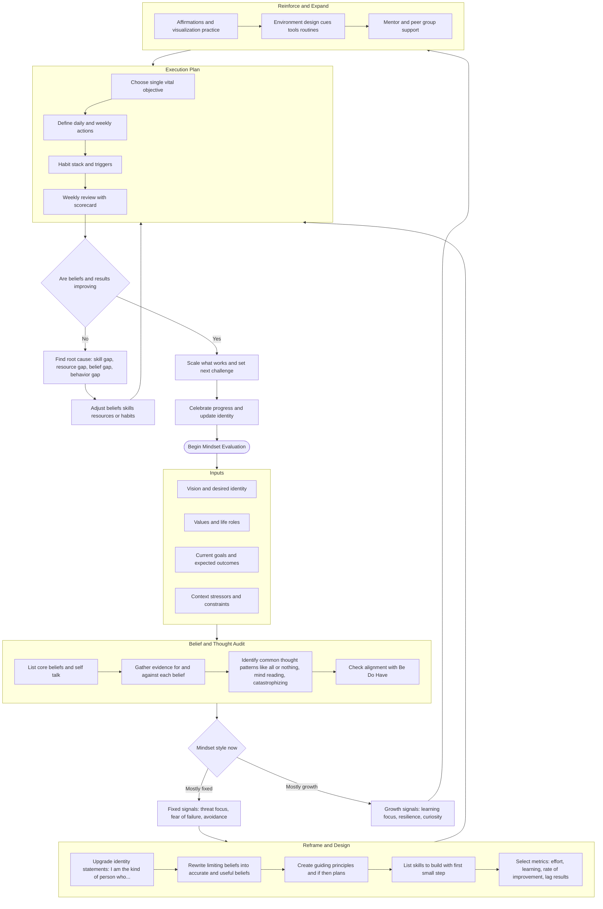

```mermaid
flowchart TB
  %% Mindset Evaluation Flow
  START([Begin Mindset Evaluation])

  subgraph INPUTS[Inputs]
    VISION[Vision and desired identity]
    VALUES[Values and life roles]
    GOALS[Current goals and expected outcomes]
    CONTEXT[Context stressors and constraints]
  end

  START --> INPUTS --> AUDIT

  subgraph AUDIT[Belief and Thought Audit]
    BELIEFS[List core beliefs and self talk]
    EVIDENCE[Gather evidence for and against each belief]
    DISTORTIONS[Identify common thought patterns like all or nothing, mind reading, catastrophizing]
    ALIGN[Check alignment with Be Do Have]
    BELIEFS --> EVIDENCE --> DISTORTIONS --> ALIGN
  end

  AUDIT --> STYLE{Mindset style now}
  STYLE -->|Mostly fixed| FIXED[Fixed signals: threat focus, fear of failure, avoidance]
  STYLE -->|Mostly growth| GROWTH[Growth signals: learning focus, resilience, curiosity]

  FIXED --> REFRAME
  GROWTH --> REINFORCE

  subgraph REFRAME[Reframe and Design]
    IDENTITY[Upgrade identity statements: I am the kind of person who...]
    REWRITE[Rewrite limiting beliefs into accurate and useful beliefs]
    PRINCIPLES[Create guiding principles and if then plans]
    SKILLS[List skills to build with first small step]
    METRICS[Select metrics: effort, learning, rate of improvement, lag results]
    IDENTITY --> REWRITE --> PRINCIPLES --> SKILLS --> METRICS
  end

  subgraph REINFORCE[Reinforce and Expand]
    AFFIRM[Affirmations and visualization practice]
    ENV[Environment design cues tools routines]
    PEERS[Mentor and peer group support]
    AFFIRM --> ENV --> PEERS
  end

  REFRAME --> PLAN
  REINFORCE --> PLAN

  subgraph PLAN[Execution Plan]
    FOCUS[Choose single vital objective]
    ACTIONS[Define daily and weekly actions]
    HABITS[Habit stack and triggers]
    REVIEW[Weekly review with scorecard]
    FOCUS --> ACTIONS --> HABITS --> REVIEW
  end

  REVIEW --> LOOP{Are beliefs and results improving}
  LOOP -->|Yes| SCALE[Scale what works and set next challenge]
  LOOP -->|No| ROOT[Find root cause: skill gap, resource gap, belief gap, behavior gap]

  ROOT --> ADJUST[Adjust beliefs skills resources or habits]
  ADJUST --> PLAN
  SCALE --> CELEBRATE[Celebrate progress and update identity]
  CELEBRATE --> START
```
