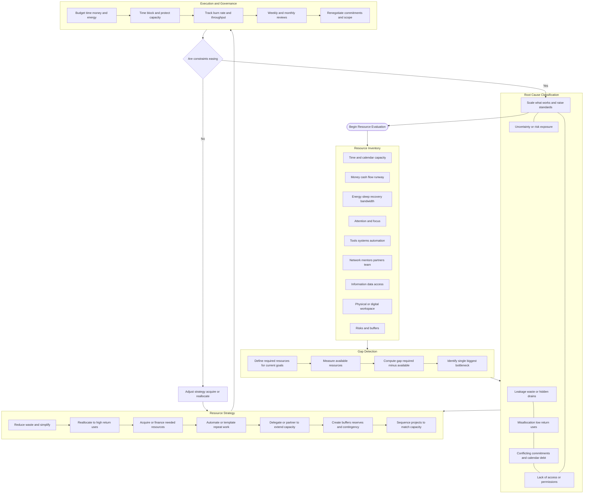

```mermaid
flowchart TB
  START([Begin Resource Evaluation])

  subgraph INVENTORY[Resource Inventory]
    TIME[Time and calendar capacity]
    MONEY[Money cash flow runway]
    ENERGY[Energy sleep recovery bandwidth]
    ATTENTION[Attention and focus]
    TOOLS[Tools systems automation]
    NETWORK[Network mentors partners team]
    INFO[Information data access]
    SPACE[Physical or digital workspace]
    RISK[Risks and buffers]
  end

  START --> INVENTORY --> GAP

  subgraph GAP[Gap Detection]
    REQUIRE[Define required resources for current goals]
    AVAILABLE[Measure available resources]
    DELTA[Compute gap required minus available]
    BOTTLENECK[Identify single biggest bottleneck]
    REQUIRE --> AVAILABLE --> DELTA --> BOTTLENECK
  end

  GAP --> ROOT

  subgraph ROOT[Root Cause Classification]
    LEAKAGE[Leakage waste or hidden drains]
    MISALLOC[Misallocation low return uses]
    CONFLICT[Conflicting commitments and calendar debt]
    ACCESS[Lack of access or permissions]
    SCALE[Lack of leverage or scalability]
    UNCERTAINTY[Uncertainty or risk exposure]
    LEAKAGE --- MISALLOC --- CONFLICT --- ACCESS --- SCALE --- UNCERTAINTY
  end

  ROOT --> PLAN

  subgraph PLAN[Resource Strategy]
    REDUCE[Reduce waste and simplify]
    REALLOC[Reallocate to high return uses]
    ACQUIRE[Acquire or finance needed resources]
    AUTOMATE[Automate or template repeat work]
    DELEGATE[Delegate or partner to extend capacity]
    BUFFER[Create buffers reserves and contingency]
    SEQUENCE[Sequence projects to match capacity]
    REDUCE --> REALLOC --> ACQUIRE --> AUTOMATE --> DELEGATE --> BUFFER --> SEQUENCE
  end

  PLAN --> EXEC

  subgraph EXEC[Execution and Governance]
    BUDGET[Budget time money and energy]
    SCHEDULE[Time block and protect capacity]
    TRACK[Track burn rate and throughput]
    REVIEWS[Weekly and monthly reviews]
    RENEG[Renegotiate commitments and scope]
    BUDGET --> SCHEDULE --> TRACK --> REVIEWS --> RENEG
  end

  EXEC --> LOOP{Are constraints easing}
  LOOP -->|Yes| SCALE[Scale what works and raise standards]
  LOOP -->|No| ADJUST[Adjust strategy acquire or reallocate]

  SCALE --> START
  ADJUST --> PLAN
```
