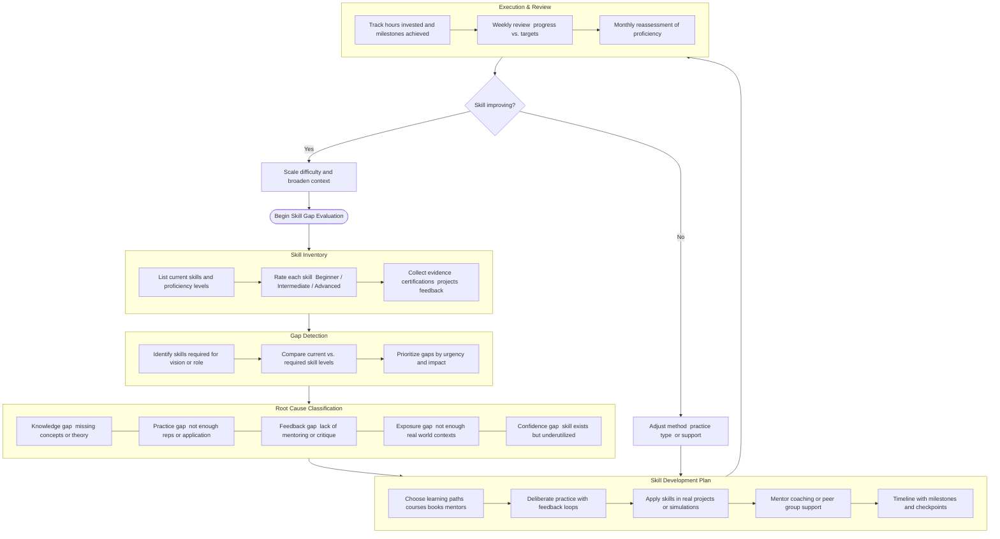

```mermaid
flowchart TB
  START([Begin Skill Gap Evaluation])

  subgraph INVENTORY[Skill Inventory]
    LIST[List current skills and proficiency levels]
    RATE[Rate each skill  Beginner / Intermediate / Advanced]
    EVIDENCE[Collect evidence  certifications  projects  feedback]
    LIST --> RATE --> EVIDENCE
  end

  START --> INVENTORY --> GAP

  subgraph GAP[Gap Detection]
    FUTURE[Identify skills required for vision or role]
    COMPARE[Compare current vs. required skill levels]
    PRIORITIZE[Prioritize gaps by urgency and impact]
    FUTURE --> COMPARE --> PRIORITIZE
  end

  GAP --> ROOT

  subgraph ROOT[Root Cause Classification]
    KNOW[Knowledge gap  missing concepts or theory]
    PRACTICE[Practice gap  not enough reps or application]
    FEEDBACK[Feedback gap  lack of mentoring or critique]
    EXPOSURE[Exposure gap  not enough real world contexts]
    CONFIDENCE[Confidence gap  skill exists but underutilized]
    KNOW --- PRACTICE --- FEEDBACK --- EXPOSURE --- CONFIDENCE
  end

  ROOT --> PLAN

  subgraph PLAN[Skill Development Plan]
    LEARN[Choose learning paths  courses books mentors]
    REP[Deliberate practice with feedback loops]
    PROJECT[Apply skills in real projects or simulations]
    COACH[Mentor coaching or peer group support]
    TIMELINE[Timeline with milestones and checkpoints]
    LEARN --> REP --> PROJECT --> COACH --> TIMELINE
  end

  PLAN --> EXEC

  subgraph EXEC[Execution & Review]
    TRACK[Track hours invested and milestones achieved]
    REVIEWW[Weekly review  progress vs. targets]
    REVIEWM[Monthly reassessment of proficiency]
    TRACK --> REVIEWW --> REVIEWM
  end

  EXEC --> LOOP{Skill improving?}
  LOOP -->|Yes| SCALE[Scale difficulty and broaden context]
  LOOP -->|No| ADJUST[Adjust method  practice type  or support]

  SCALE --> START
  ADJUST --> PLAN
```
